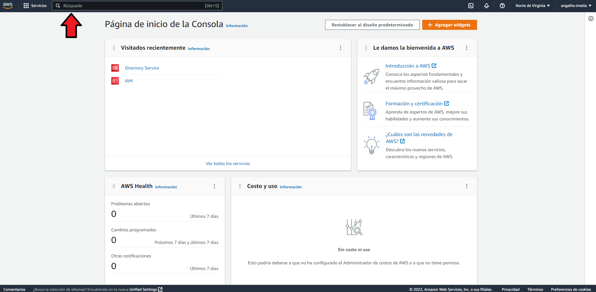
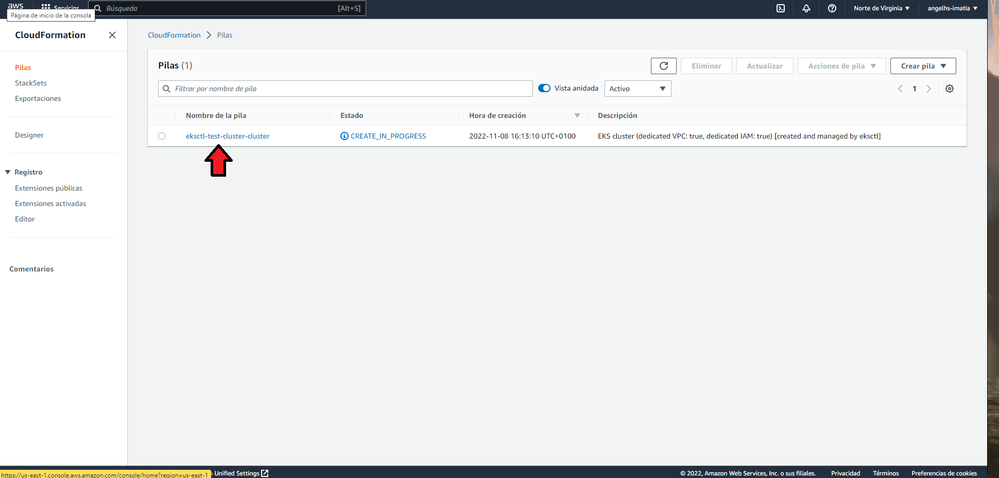
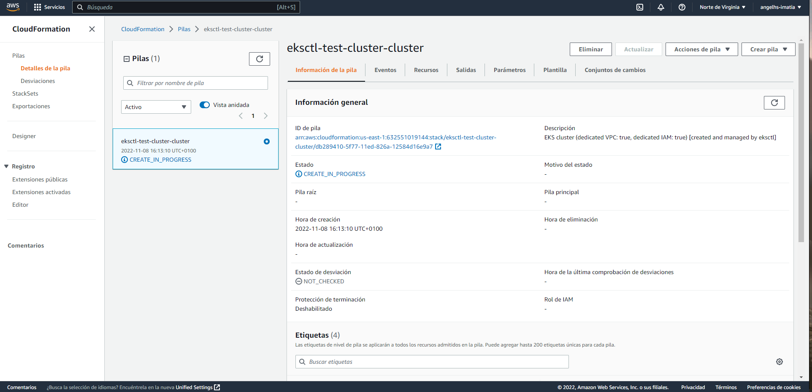

> _**Sección 23:** AWS EKS & Kubernetes: Crea un clúster real para ambientes productivos_

# Video 179 - Crea un clúster con AWS EKSCL

[EKS DOC](https://docs.aws.amazon.com/eks/latest/userguide/what-is-eks.html)

Podemos crear un clúster con la herramienta EKS mediante el siguiente comando.

```shell
eksctl create cluster \
  --name test-cluster \
  --without-nodegroup
```
_output:_
```plaintext
2022-11-08 16:13:04 [ℹ]  eksctl version 0.117.0
2022-11-08 16:13:04 [ℹ]  using region us-east-1
2022-11-08 16:13:04 [ℹ]  subnets for us-east-1b - public:192.168.0.0/19 private:192.168.64.0/19
2022-11-08 16:13:04 [ℹ]  subnets for us-east-1a - public:192.168.32.0/19 private:192.168.96.0/19
2022-11-08 16:13:04 [ℹ]  using Kubernetes version 1.23
2022-11-08 16:13:04 [ℹ]  creating EKS cluster "test-cluster" in "us-east-1" region with
2022-11-08 16:13:04 [ℹ]  if you encounter any issues, check CloudFormation console or try 'eksctl utils describe-stacks --region=us-east-1 --cluster=test-cluster'
2022-11-08 16:13:04 [ℹ]  Kubernetes API endpoint access will use default of {publicAccess=true, privateAccess=false} for cluster "test-cluster" in "us-east-1"
2022-11-08 16:13:04 [ℹ]  CloudWatch logging will not be enabled for cluster "test-cluster" in "us-east-1"
2022-11-08 16:13:04 [ℹ]  you can enable it with 'eksctl utils update-cluster-logging --enable-types={SPECIFY-YOUR-LOG-TYPES-HERE (e.g. all)} --region=us-east-1 --cluster=test-cluster'
2022-11-08 16:13:04 [ℹ]
2 sequential tasks: { create cluster control plane "test-cluster", wait for control plane to become ready
}
2022-11-08 16:13:04 [ℹ]  building cluster stack "eksctl-test-cluster-cluster"
2022-11-08 16:13:05 [ℹ]  deploying stack "eksctl-test-cluster-cluster"
```

Podemos ver más información de la pila que este comando crea de la siguiente manera:

**01- _Nos dirigimos a la página de inicio de la consola de AWS_**  
[https://us-east-1.console.aws.amazon.com/console/home](https://us-east-1.console.aws.amazon.com/console/home)

---

**2- _Nos dirigimos a CloudFormation_**  
_En la barra superior de búsqueda escribimos CloudFormation y presionamos enter._



---

**3- _Entramos en el stack que queramos_**  



---

**4- _Finalmente podemos observar la información del stack_**  

